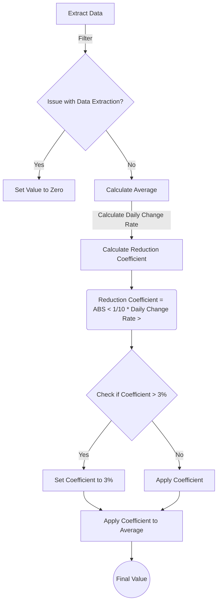
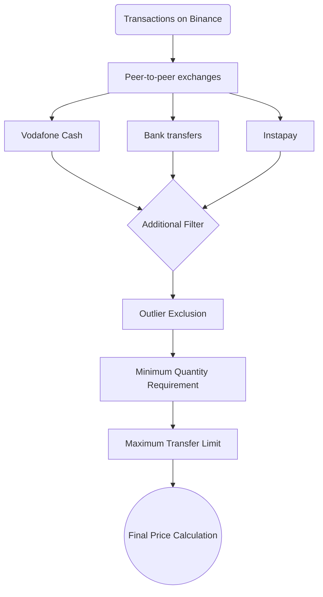

# Cairo Coin
> **Note:** study and academic purposes only, not for commercial use.

**Spotting Egypt's Parallel Currency Markets: Keeping an Eye on Every Pulse.**


This project  primary goal is to provide insight into Egypt's parallel currency markets, offering a comprehensive overview of pricing dynamics and trends. Through meticulous data analysis and algorithmic processing.

1.  **Market Identification:** The project initiates by identifying parallel markets used for pricing the Egyptian pound. This step lays the foundation for comprehensive market analysis.
    
2.  **Data Sourcing:** Specific data sources tailored to these parallel markets are meticulously determined to ensure accuracy and relevance.
    
3.  **Scraping Algorithms:** Advanced algorithms are developed to effectively extract and cleanse data from diverse sources, preparing it for analysis.
    
4.  **Data Processing:** Extracted data undergoes thorough classification, calculation, and filtering processes to derive precise and actionable insights.
    
5.  **Data Management:** Processed data is securely stored, and an Application Programming Interface (API) is created to facilitate seamless data access.
    
6.  **Indicators and Averages:** Utilizing calculated rate of change averages, daily, and momentary indicators are designed to capture market fluctuations accurately.
    
7.  **Endpoint Integration:** Integration with endpoints ensures efficient data connectivity and enables real-time access to market insights.
    
8.  **Frontend Presentation:** The project culminates with the development of a user-friendly frontend interface, offering a concise yet comprehensive presentation of analyzed data.


 ## Market Identification

In this phase, identifying the parallel markets influencing the pricing dynamics of the Egyptian pound. This entails thorough research and analysis of diverse financial markets operating alongside the official exchange market

> we have identified and narrowed down these parallel markets, summarized as follows:

-   **Local Black Market:** Informal trading against the US dollar, reflecting unofficial exchange rates.
    
-   **USDT:** Trading on cryptocurrency exchanges like Binance.
    
-   **Gold Dollar:** Gold is evaluated in the local market based on a parallel exchange rate for the dollar.
    
-   **Arbitrage Dollar:** It is the result of GDR stocks available in the Egyptian Exchange and re-salable in global stock exchanges.
    
-   **Import Dollar:** A parallel market for the dollar emerged between exporters and importers, where the dollar obtained by the exporter is backed by standby credits, allowing it to be reused in import transactions.
    
-   **NDF (Non-Deliverable Forward) contracts:** Derivative financial instruments settled in a reference currency, used for hedging currency risk in markets with exchange controls.
    

Understanding these markets sets the stage for analyzing currency trends comprehensively.


## Data Sourcing

In this phase, we conduct research to identify reliable data sources for the previously identified parallel markets, ensuring the accuracy and ongoing updating of information. We prioritize markets based on our ability to access this information effectively.

> we have identified sources as follows:

 - **Local Black Market:** Numerous websites offer exchange rate listings for the black market. We've selected 6 websites for monitoring, including: eg **currnecy, sarf, gold price now, real egp, parelle rate, souq today**.
 
 - **USDT:** The majority of transactions involving this currency in the Egyptian market occur on the **Binance** platform.
 
 - **Gold:** Pricing of gold in the Egyptian market is largely influenced by major traders. Three sources have been selected for pricing: **btc, gold era, sagha**. Additionally, in certain exceptional cases, when there is a significant and unexpected increase in the price of the dollar in parallel markets, traders refrain from announcing pricing. Instead, an additional pricing is calculated based on the dollar rate in the black market, with a margin added to this rate, and the gold price is then derived from it.

 - **Arbitrage:** There are numerous GDR stocks, but the most well-known and commonly used is CIB's COMI, listed in the London Stock Exchange under the symbol CBKD. **MarketWatch** has been selected as a source for information on the stock price in both local and international markets.
 
Import and NDF: They have been excluded due to the inability to identify a precise and consistent source for them.


## Scraping Algorithms

In this phase, advanced algorithms are developed to effectively extract and cleanse data from the identified sources. These algorithms are tailored to each specific source, ensuring accurate and reliable data extraction for subsequent analysis.

> Key activities include:

-   Designing scraping algorithms tailored to each selected data source to extract relevant information.
    
-   Implementing mechanisms to handle data from diverse formats and structures, ensuring consistency in extraction.
    
-   Incorporating error handling and data validation procedures to maintain data integrity throughout the extraction process.

The scraping code is executed using Google Apps Script within Google Sheets [Github repo](https://github.com/HamedMohamed99/Cairo-Coin-Data)


## Data Processing

In this phase, advanced algorithms are developed to effectively extract and cleanse data from the identified sources. These algorithms are tailored to each specific source, ensuring accurate and reliable data extraction for subsequent analysis.

>  Arbitrage data is exempted from these calculations due to its precision, while the rest are processed as follows:

 - **Local Black Market:** 
 --   The final value here is determined based on the average of the extracted values from the sources. If there is an issue extracting data from any source, its value is set to zero and excluded from the average calculation. 
 -- It has been observed that during significant price increases, the increases in the sources are greater than those observed in reality. Therefore, a variable coefficient has been added to the final value, which depends on the daily change rate of the average extracted values. This coefficient reduces the rate of increase for the final value in inverse proportion to the rate of increase for the average extracted values.
These measures ensure that the final value accurately reflects market conditions while accounting for anomalies in data extraction.



 
 - **USDT:** Transactions on Binance occur through peer-to-peer P2P exchanges, facilitated by various payment methods. Research has shown that the most prominent among these methods are Vodafone Cash, followed by bank transfers and Instapay. As a result, we filtered the extracted data to include only these payment methods.
-- **Additional Filters:**
   - **Outlier Exclusion:**
     Filtering out values that significantly deviate from the range of other values.
   - **Minimum Quantity Requirement:**
     Setting a minimum quantity threshold for transactions.
   - **Maximum Transfer Limit:**
     Establishing a minimum limit for the maximum transfer amount within the transaction.
     
   After applying these filters to the data, a quantity is determined from which the final price is calculated. Since the transactions are sorted from the cheapest, transactions are selected sequentially until the specified quantity is reached. However, If a transaction with a quantity greater than the pre-defined amount for a single transaction is encountered, only the pre-defined amount is considered for that transaction.




 
 - **Gold:** The algorithm compares between the pricing obtained from the sources and the calculated pricing. Priority is given to the pricing from the sources unless the price of the dollar in the black market exceeds it. In this case, the calculation pricing is used instead.
  ```mermaid

graph TD;
    A[Extract Data from Sources] --> B[Compare Price from Sources With local black market dollar];
    B -- Higher --> C[Use Source Pricing];
    B -- Lower --> D[Use Calculated Pricing];
    C --> E(Final Pricing);
    D --> E;

```

Part of Data Processing is with scraping code [Github repo](https://github.com/HamedMohamed99/Cairo-Coin-Data)


## Data Management

In this phase, the following details were implemented:

- **API Development**

	-   **Framework Selection:** The API was developed using Django.
    
	-   **Database Management:** PostgreSQL was chosen as the database management system.
    
	-   **Data Organization:** The database was structured to efficiently organize and manage the collected data.
    
- **User Authentication and Access Control**

    -   **User Accounts:** A user management system was integrated into the Django, allowing users to create accounts securely.
    
	-   **Access Control:** Access to API endpoints was controlled based on user authentication and authorization, ensuring data security and privacy.
	

## Indicators and Averages

In this phase, the following tasks were accomplished:

- **Algorithm Development for Averages Calculation**

	-   **Hourly and Daily Averages:** Algorithms were devised to calculate hourly and daily averages for creating a historical record of data. These averages provide insights into pricing trends over specific time periods.
    
	-   **Rate of Change Calculation:** Mathematical formulas were implemented to compute the rate of change for the collected data. This metric helps in understanding the degree of fluctuation or stability in market prices.
    

- **Indicator Creation**

	-   **Daily Market Indicator:** An indicator was developed to assess the market's condition on a daily basis. It relies on the daily rate of change for three key markets: Binance, local black market, and gold. Weightage is assigned to each market, contributing to a final numerical value representing the currency's status throughout the day.
    
	-   **Instantaneous Change Indicator:** Another type of indicator was crafted to monitor the momentary changes in each of the aforementioned markets. This indicator offers real-time insights into the fluctuations occurring within these markets.


## Endpoint Integration

In this phase, several endpoints were developed to cater to different data,
each endpoint was meticulously linked with its corresponding data in the database, ensuring seamless retrieval and manipulation of relevant information.
    

- **API Key Implementation**

	-   **API Keys Generation:** API keys were generated to authenticate users and grant them access to the endpoints. These keys serve as credentials for accessing the API securely.
    
	-   **Token-Based Authentication:** A token-based authentication system was implemented, where users are issued tokens upon successful authentication. These tokens act as a form of currency, allowing users to access the desired endpoints.
    
	-   **Token Balance Management:** A token balance system was established, where users are allocated a certain amount of tokens upon registration. Each endpoint access deducts a specified number of tokens from the user's balance, ensuring fair usage and resource allocation.
    

- **Access Control and Authorization**

	-   **Endpoint Value Assignment:** Each endpoint was assigned a specific value or cost in terms of tokens required for access. This ensures that users are aware of the resource cost associated with each endpoint and can manage their token balance accordingly.
    
	-   **Authorization Mechanisms:** Authorization mechanisms were implemented to verify the user's token balance before granting access to the requested endpoints. Users with insufficient token balance are denied access until they replenish their tokens.


## Frontend Presentation

In this phase, the following main tasks were completed:

- **User API Interface** [*Redirect*](https://cairo-coin.azurewebsites.net/Plus/)

	-   **Account Management Interface:** A user-friendly interface was designed to allow API users to manage their accounts efficiently. This interface enables users to create and manage API keys, as well as monitor their usage and token balance.
    
	-   **Token Consumption Tracking:** The interface provides users with visibility into their token consumption, allowing them to track their API usage and manage their token balance effectively.
 		
		   

- **Market Data Interface** [*Redirect*](https://cairo-coin.azurewebsites.net/Plus/lite) **for mobile only*

	-   **Simple Market Data Display:** Another interface was developed to provide non-API users with a quick overview of market data and its metrics in a user-friendly manner.
    
	-   **Basic Indicators Display:** This interface includes basic indicators and metrics related to market data, allowing users to gain insights into market trends and changes effortlessly.
    

- **Application Development**

	-   **Two Interface Applications:** Two separate applications were developed, each catering to a different user group. One application is tailored for API users, while the other is designed for regular users interested in market data.
    
	-   **React Native Web View Implementation:** Both applications were built using React Native Web View, with slight differences in user experience to simulate the experience of using native applications on mobile devices.
	

		
